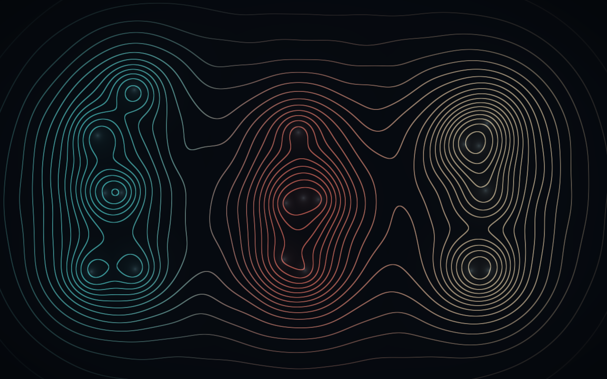

# Motion field

Open `motion_field.pde` in Processing 4.5.6 and press Run. Keep the full repository together so the sketch can load the shared files from `../p5f_sample/data/`. No additional Processing library is required. For export, copy those three BVH files into this folder's `data/` directory first.

Six joints from each of the three recordings become an array of eighteen `vec3` uniforms: X, Y, and dancer number. One fullscreen rectangle runs `data/field.frag`; its pixels sum joint influence, draw logarithmic isocontours, and mix a small interference term. Screen derivatives keep contour edges smooth at different resolutions. The third uniform component chooses the restrained cyan/coral/ivory palette.

- `motion_field.pde`: BVH-to-uniform conversion, shader pass, controls.
- `data/field.frag`: field, contour spacing, antialiasing, and palette.
- `MotionData.pde`: legacy BVH adapter; recenters root X/Z for the side-by-side layout.
- `SketchRun.pde`: shader validation, deterministic capture, and smoke test.

Space pauses; + / - change contour density; J reveals the driving joints; R resets; H toggles labels; S saves a screenshot. Window resizing preserves the shape proportions. Change the six entries in `jointNames` to try different body landmarks, or change the `influence` and `wave` expressions to explore another field.

See the [root README](../README.md#development-and-verification) for deterministic CLI captures. Only the new sketch/shader code is covered by [`LICENSE-new-examples`](../LICENSE-new-examples); the original BVH data and parser JAR retain their existing copyright status.
