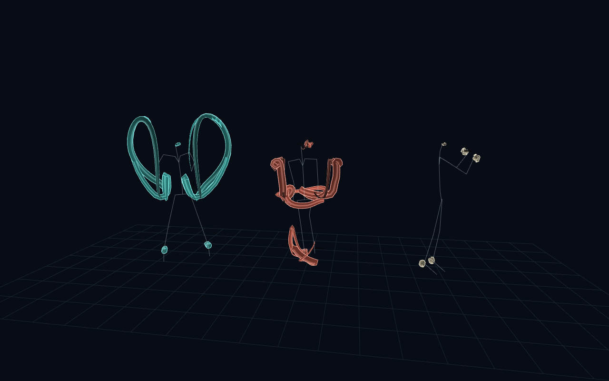

# Motion ribbons

Open `motion_ribbons.pde` in Processing 4.5.6 and press Run. Keep the full repository together so the sketch can load the shared files from `../p5f_sample/data/`. No additional Processing library is required. For export, copy those three BVH files into this folder's `data/` directory first.

The CPU caches five joint trajectories per dancer and samples a 3.2-second history into reusable `PShape` triangle strips. The strip width faces the current camera. The vertex shader transports position plus age/edge attributes, and the fragment shader adds thin bright edges and a restrained cyan, coral, or ivory sheen. The topology is generated on the CPU because standard Processing `PShader` provides vertex and fragment stages, not a geometry stage.

- `motion_ribbons.pde`: playback, camera, drawing, keyboard controls.
- `RibbonDancer.pde`: pose cache, interpolation, triangle-strip vertices.
- `data/ribbon.vert` / `data/ribbon.frag`: the two shader stages.
- `MotionData.pde`: legacy BVH library adapter; recenters root X/Z for the side-by-side display.
- `SketchRun.pde`: capture and validation helper; the visual algorithm does not depend on test mode.

Change `historySeconds`, `steps`, or `halfWidth` in `RibbonDancer.pde` to change the trails. Change `ink` and the edge/sheen calculation to tune the material. At a motion loop boundary the trail starts fresh rather than connecting unrelated end/start poses.

Space pauses; drag orbits; R resets; H toggles labels; S saves a screenshot. Deterministic CLI captures are described in the [root README](../README.md#development-and-verification).

Only the new sketch/shader code is covered by [`LICENSE-new-examples`](../LICENSE-new-examples). The original BVH data and the parser JAR retain their existing copyright status.
